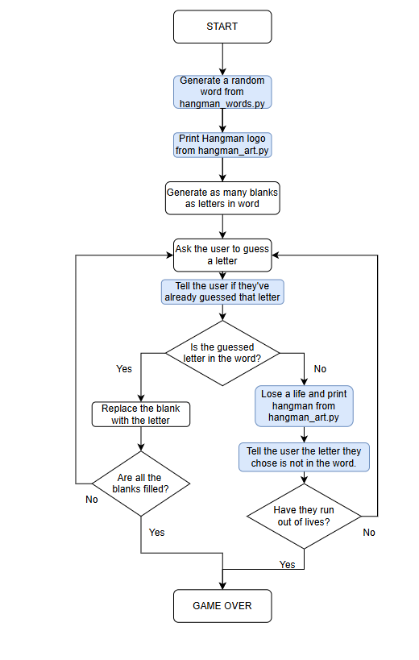

# Hangman Game (Python)

A simple **command-line Hangman** game made using Python.

You have a limited number of lives to guess the hidden word **one letter at a time**. Correct guesses reveal the letters, and wrong guesses reduce a life until the game ends.

---

## Demo (How it looks)

- Prints a Hangman logo / text art
- Shows blanks like `_ _ _ _` for the word
- Takes letter input from the user
- Updates the word display and lives until you **win** or **lose**

---

## Project Structure

```
hangman projects/
├── day_7.py                 # Main game file (run this)
└── hangman_flowchart.png    # Game logic flowchart
```

---

## Flowchart

This flowchart represents the exact logic followed in the game:



---

## How the Game Works

1. **Start the game**
2. A random word is selected inside the program
3. Display blanks (`_`) equal to the length of the word
4. Ask the user to guess a letter
5. If the letter was already guessed → notify the user
6. If the letter is in the word:
   - Replace the corresponding blanks with the letter
   - If all blanks are filled → **You Win 🎉**
7. If the letter is NOT in the word:
   - Lose a life
   - Continue the game until lives become 0
   - If lives reach 0 → **Game Over 💀**

---

## Requirements

- Python **3.x**

(No external libraries required)

---

## Run the Game

### 1) Clone the repository

```bash
git clone https://github.com/ShreyaSingh1505/Hangman-Project
cd "hangman projects"
```

### 2) Run the game

```bash
python day_7.py
```

> If your system uses `python3`, run:

```bash
python3 day_7.py
```

---

## Notes

- Ensure `day_7.py` and `hangman_flowchart.png` are in the **same folder**.
- You can modify the word list inside the Python file to add more words.

---

## Author

**Shreya Singh**
